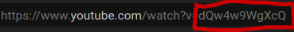

# Scraping videos from youtube

For the purpose of scraping videos from youtube and information related to it like, publishing channel, description of the video etc I have used the following tools :
* [`youtube_dl`](https://github.com/ytdl-org/youtube-dl)
* [`Youtube Data API`](https://developers.google.com/youtube/v3) 

## Youtube Data API
The `Youtube Data API` lets you incorporate functions normally executed on the YouTube website into your own website or application. The feature i've used of this API is that of *Search*. With search I can get the results of I would recieve when I make a search in Youtube. I use the search to get details about the video like Title, Description, id of the video and also the channel name and id of the publisher.

### Possibilities
The search feature of the Youtube Data API alsos allows for to mentio a location in the search queries. This can be used to find videos which mention that certain location in the metadata.

## youtube_dl
This libraru allows to scrape data regarding a youtube data by taking the page's URL as input. This I feel was the limitation of the library, that it needed specific URL of the video to get the data. After finding a pattern in the youtube video's URL ( that all youtube video links were standard except for the id mentioned in the end of the url) as encircled in red in the image below

This is Id of the video which I was able to get from the Youtube Data API and thus was able to download the video.
### Possibilities
youtube_dl also allows to get tags which are present in a youtube video which might enhance our search queries which we make to the Youtube Data API.

## Limitations faced
The major limitations came from Youtube Data API, which first is a paid service (you get free credits for 3 months which I used). Another limitation is that for each query you can get at max 50 results. 

## My submission
My submission include only 1 video which I'd downloaded for testing purposes and submitting more than one could lead to crossing of submission limits of moodle. Also Youtube Data API being a paid service, I cannot share the credentials required for running of the API. But what i'm submitting is [results.csv](results.csv) which contains the results of making a query with search string as __"farmer protests"__. The number of queries can be increased by adding more search strings in the [queries.csv](queries.csv). (Maybe I can show the working of the code on a meet)